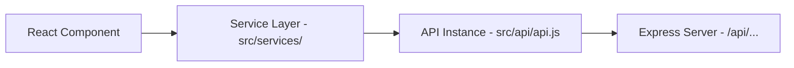

# API Integration Guideline & Standard Architecture

This document outlines the standard procedures and architectural decisions for integrating APIs within the **NexCart AI E-commerce** project. Adhering to these guidelines ensures a consistent, secure, and maintainable codebase.

---

## 🏗️ 1. Architecture Overview

We follow a **Service-Based Architecture** where the frontend components do not talk directly to the backend. Instead, they interact through a "Service Layer" that uses a centralized "API Instance".



---

## 🛡️ 2. Centralized Axios Instance (`src/api/api.js`)

All requests MUST flow through the centralized Axios instance to benefit from automatic header injection and error handling.

### Features:
- **Base URL**: Managed via environment variables.
- **Interceptors**: Automatically attaches the JWT `Authorization` header from `localStorage`.
- **Global Error Handling**: Standardizes how we treat 401 (Unauthorized) errors.

```javascript
import axios from 'axios';

// 1. Create instance with environment-based Base URL
const api = axios.create({
  baseURL: import.meta.env.VITE_API_URL || 'http://localhost:5050/api',
  timeout: 10000,
  headers: { 'Content-Type': 'application/json' }
});

// 2. Request Interceptor: Inject JWT Token
api.interceptors.request.use(
  (config) => {
    const token = localStorage.getItem('token');
    if (token) {
      config.headers.Authorization = `Bearer ${token}`;
    }
    return config;
  },
  (error) => Promise.reject(error)
);

// 3. Response Interceptor: Global Error Catching
api.interceptors.response.use(
  (response) => response,
  (error) => {
    if (error.response?.status === 401) {
      // Auto logout if token expires
      localStorage.removeItem('token');
      window.location.href = '/login?expired=true';
    }
    return Promise.reject(error);
  }
);

export default api;
```

---

## 📦 3. Service Layer (`src/services/`)

Decouple API logic from UI logic. Every major feature (Cart, Products, Auth) should have its own service file.

### Rules for Services:
- Use `async/await`.
- Return data directly (let components handle the UI state).
- Handle resource-specific mapping if the backend format differs from the frontend.

**Example: `CartService.js`**
```javascript
import api from '../api/api';

const CartService = {
  // Add item to cart
  addToCart: async (productId, quantity = 1, options = {}) => {
    const response = await api.post('/cart/add', {
      productId,
      quantity,
      ...options
    });
    return response.data;
  },

  // Get user's cart
  getCart: async () => {
    const response = await api.get('/cart');
    return response.data;
  }
};

export default CartService;
```

---

## ⚛️ 4. Integrating in Components

Use the `Service` methods within `useEffect` or event handlers.

### 🔄 Loading & Error States
Always implement defensive UI patterns to avoid blank screens or crashes.

```jsx
import CartService from '../services/CartService';

const [loading, setLoading] = useState(false);
const [error, setError] = useState(null);

const handleAddToCart = async (product) => {
  setLoading(true);
  setError(null);
  
  try {
    const result = await CartService.addToCart(product.id);
    toast.success('Successfully added to cart!');
  } catch (err) {
    setError(err.response?.data?.message || 'Failed to sync cart');
    toast.error('Network Error: Please try again');
  } finally {
    setLoading(false);
  }
};
```

---

## 🛠️ 5. Backend Standardization (`backend/routes/`)

To keep the frontend integration smooth, the Express backend should follow these rules:

1. **Consistent JSON Format**: Always return `{ "message": "...", "data": ... }`.
2. **HTTP Status Codes**:
   - `200 OK`: Success (GET, PUT).
   - `201 Created`: Successfully created (POST).
   - `400 Bad Request`: Validation failure.
   - `401 Unauthorized`: No token or invalid token.
   - `403 Forbidden`: Authenticated but lack permissions.
   - `404 Not Found`: Resource doesn't exist.
   - `500 Server Error`: Unexpected backend crash.

---

## 🧪 6. Best Practices Checklist

- [ ] **No Hardcoded URLs**: Use `api.get('/products')`, not `api.get('http://...')`.
- [ ] **Token Storage**: Store JWT tokens in `localStorage` under the key `'token'`.
- [ ] **Loading Indicators**: Always show a spinner or `disabled` state on buttons during API calls to prevent duplicate requests.
- [ ] **Interceptors**: Log out the user automatically if the API returns a 401 error.
- [ ] **Destructuring**: Destructure `response.data` in the service layer for cleaner component usage.
- [ ] **Environment Variables**: Create a `.env` file in the root for `VITE_API_URL`.

---

## 🚀 Future Recommendations
Consider migrating to **React Query (TanStack Query)** for more complex features. It provides:
- Automatic caching.
- Built-in loading/error states.
- Background refetching.
- Optimistic updates.
