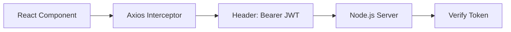

# 📦 NexCart API Integration Cheat Sheet (Screenshot Ready)

````carousel


<!-- slide -->

## 🛠️ Step 1: Centralized API Setup
**Location:** `src/api/api.js`

```javascript
/* axios config */
const api = axios.create({
  baseURL: import.meta.env.VITE_API_URL,
  headers: { 'Content-Type': 'application/json' }
});

/* JWT injection */
api.interceptors.request.use(config => {
  const token = localStorage.getItem('token');
  if (token) config.headers.Authorization = `Bearer ${token}`;
  return config;
});
```
✅ **Pro-Tip:** Always handle `401 Unauthorized` errors in interceptors to auto-logout users.

<!-- slide -->

## 📦 Step 2: The Service Layer
**Location:** `src/services/`

| Feature | Endpoint | Service Layer Method |
| :--- | :--- | :--- |
| **Auth** | `/auth/login` | `AuthService.login(data)` |
| **Shop** | `/products` | `ProductService.getAll()` |
| **Cart** | `/cart/add` | `CartService.add(id)` |
| **Orders** | `/orders` | `OrderService.checkout()` |

> [!TIP]
> Keep your components clean! UI handles the **Spinner**, Service handles the **Data**.

<!-- slide -->

## 🛡️ Step 3: Global Security Flow
**MERN Security Checklist:**

1. **Frontend:** Store JWT in `localStorage`.
2. **Frontend:** Attach `Authorization: Bearer <token>` to every request header.
3. **Backend Middleware:** Use `authMiddleware.js` to verify JWT.
4. **Backend Controller:** Access user via `req.user.id`.



<!-- slide -->

## 🚀 Future Scalability
**When to use TanStack Query?**
- When you need **Automatic Caching**.
- When you want **Optimistic UI Updates**.
- When you need **Offline Support**.

---
*Created for NexCart AI E-commerce*
````
